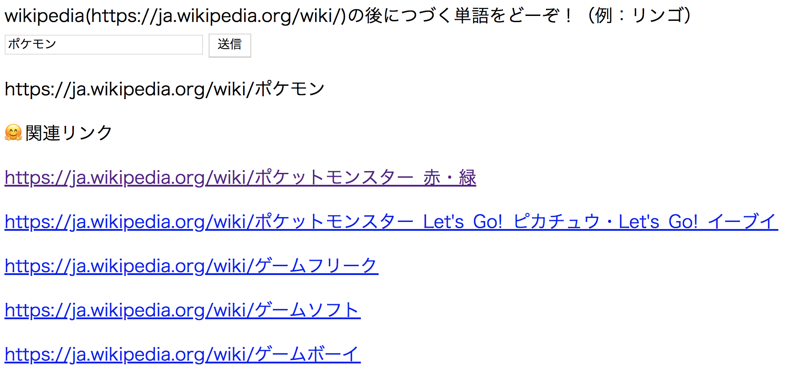

SearchEngineForSimilarPages
----
You can search similar pages.
Model is created using word2vec.

## Description
* CreateModel.py - create model from corpus of Wikipedia
* server.py - get similar pages on localhost

## Demo

## Usage
1. Create corpus
2. Run CreateModel.py and get "wiki.model"
3. Run server.py
4. See your page on localhost:8888